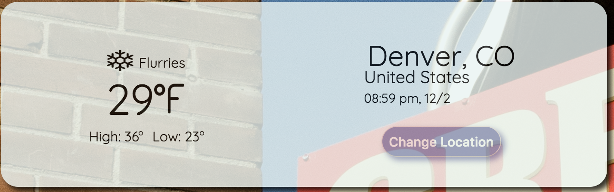
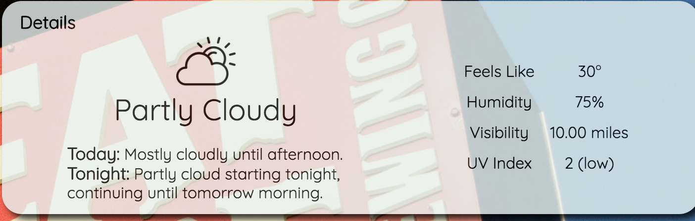
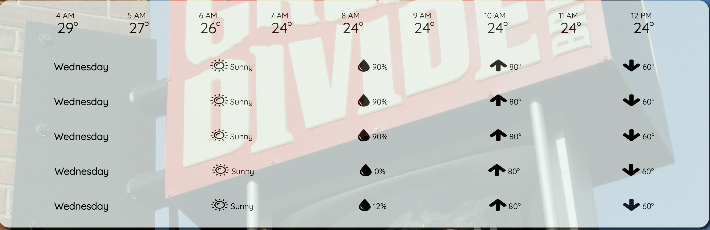

[](http://waffle.io/KathleenYruegas/sweater_weather_fe)

Sweater Weather is a weather app designed to give the user varying degrees of information based upon the location they select. There is a section for current weather, a daily overview, an hourly forecast, as well as the 5-day forecast. The background image changes based upon the location the user puts in.

Visit the deployed site here: https://kathleenyruegas.github.io/sweater_weather_fe/

* Core Contributors
This app was built by myself, Kathleen Yruegas, github.com/KathleenYruegas

##### Purpose

This project was aimed at building out a modular front-end in vanilla JavaScript and JQuery to consume the API endpoints I built in a prior project (see: https://github.com/KathleenYruegas/sweater_weather).  


* Technologies Used
  - HTML5
  - CSS3
  - JQuery
  - ES6


* Setup
  If you would like to clone down this project, open up your terminal and when you're in the directory you'd like to put this in, type these commands:
  ```
     1. https://github.com/KathleenYruegas/sweater_weather_fe.git
     2. npm install
     3. npm start (to start your server)
     ```
    You can then visit `localhost:8080` to see the site.

* The App


  This app has three sections, the upper left-hand section displays the location (default is Denver, CO) input by the user when they click on Change Location. All the information is then updated via information retrieve from making a fetch call to an endpoint where the time, temperature, and forecast information is received.
 

  The upper right-hand section will also update accordingly with the user's chosen location.
  

  The bottom section shows an hourly breakdown of temperatures as well as the next 5 days' forecasts.  All of this information from all 3 sections is pulled from one API call.
  

  The background image is generated based on the given location. The app makes an API call to an endpoint that generates a random image relevant to that location.  

* Next Iteration
  - User button to hide all three information boxes so the background picture can be fully viewed.
  - Ability to log in.
  - Ability for logged in user to favorite locations.
